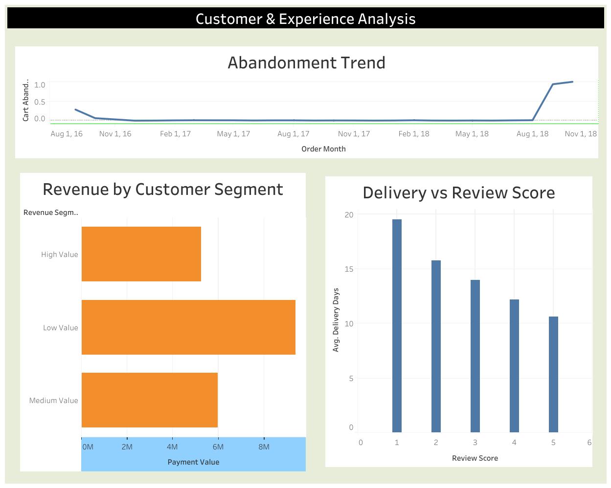
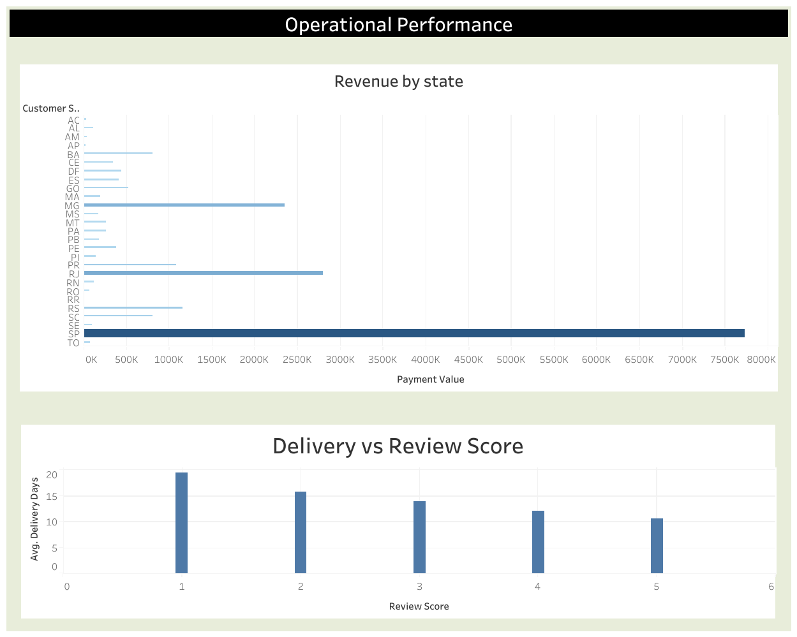

# E-Commerce Cart Abandonment & Sales Performance Analysis

A complete end-to-end Business Analyst case study analyzing cart abandonment risk and sales performance using real-world eCommerce transactional data (99K+ orders).

This project demonstrates SQL analysis, process modeling, dashboard development, and strategic recommendations aligned with a real business scenario.

---

##  Project Objective

The business scenario suggested:

- High cart abandonment  
- Declining sales performance  
- Customer dissatisfaction  

The objective of this project was to:

- Validate business performance using SQL  
- Identify operational bottlenecks  
- Infer abandonment indicators from available data  
- Build interactive dashboards  
- Provide actionable business recommendations  

---

##  Tools & Technologies Used

- **Google BigQuery** – SQL analysis  
- **Tableau Public** – Interactive dashboards  
- **BPMN** – Checkout process modeling  
- **Business Analysis Framework** – Strategic interpretation  

---

##  Key Findings

### 1️) Revenue Analysis
- Strong growth observed in 2017  
- Revenue volatility in 2018  
- No immediate collapse, but performance instability  

### 2️) Cart Abandonment (Proxy Indicator)
- Cancellation-based abandonment rate: **~0.63%**
- Indicates low direct checkout failure  

### 3️) Delivery Impact on Satisfaction
- 1-star reviews → ~20.85 average delivery days  
- 5-star reviews → ~10.22 average delivery days  

Strong correlation between delayed delivery and dissatisfaction.

### 4️) Customer Segmentation
Customers were segmented based on lifetime revenue:
- High Value  
- Medium Value  
- Low Value  

Revenue was found to be **volume-driven**, with low-value customers collectively contributing the largest share.

---

##  Process Modeling (BPMN)

Two process models were created.

### Current State (AS-IS)
- No payment retry mechanism  
- No SLA monitoring  
- Reactive operational workflow  

### Future State (TO-BE)
- Transparent pricing  
- Payment retry loop  
- Seller SLA monitoring  
- Escalation alerts  
- Post-delivery retention triggers  

---

##  Tableau Dashboards

### 1️) Executive Overview

- Total Sales  
- Total Orders  
- Cart Abandonment Rate  
- Average Delivery Days  
- Monthly Revenue Trend  

---

### 2️) Customer & Experience Analysis

- Revenue by Customer Segment  
- Abandonment Trend  
- Delivery vs Review Correlation  

---

### 3️) Operational Performance

- Revenue by State  
- Delivery Distribution  
- Performance Monitoring  

---

##  Live Dashboard

https://public.tableau.com/views/executive_overview_dashboard/MonthlyOrderVolume?:language=en-US&:sid=&:redirect=auth&:display_count=n&:origin=viz_share_link

---

##  Strategic Recommendations

- Improve delivery SLA monitoring  
- Introduce payment retry mechanism  
- Launch retention programs  
- Monitor cancellation spikes  
- Target dissatisfied customer segments  

---

##  Business Impact

Although direct abandonment is currently low, operational ineffencies present structural risks.

The recommendations focus on:

- Preventing escalation of abandonment risk  
- Stabilizing revenue volatility  
- Improving customer satisfaction  
- Strengthening operational governance  

---

##  Author

**Om Dadhe**

- LinkedIn: https://www.linkedin.com/in/contactom/  
- GitHub: https://github.com/OmDadhe  

---

##  License

This project is created for educational and portfolio purposes.
